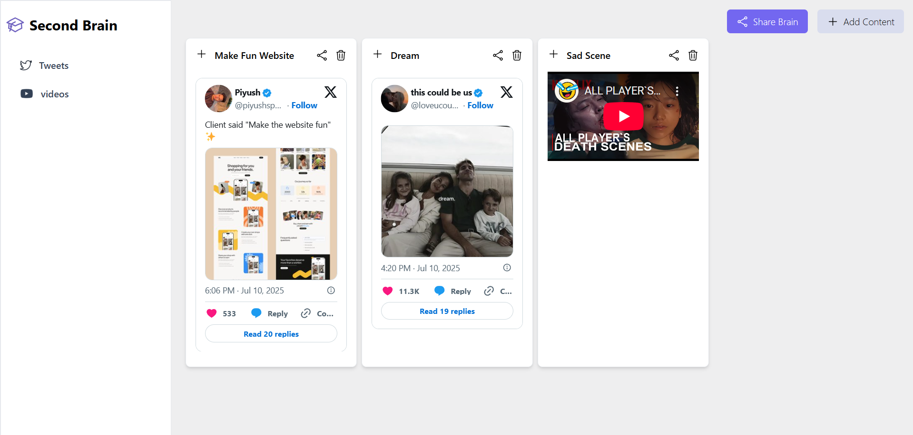
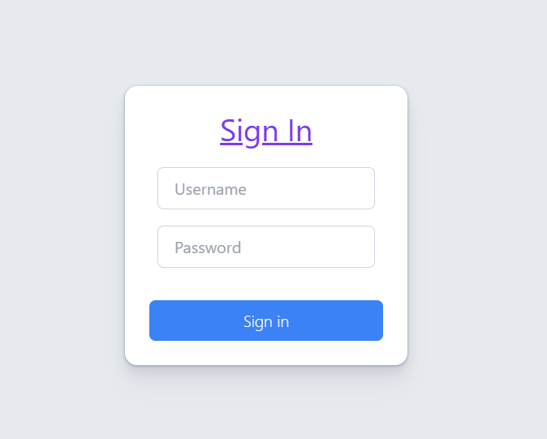
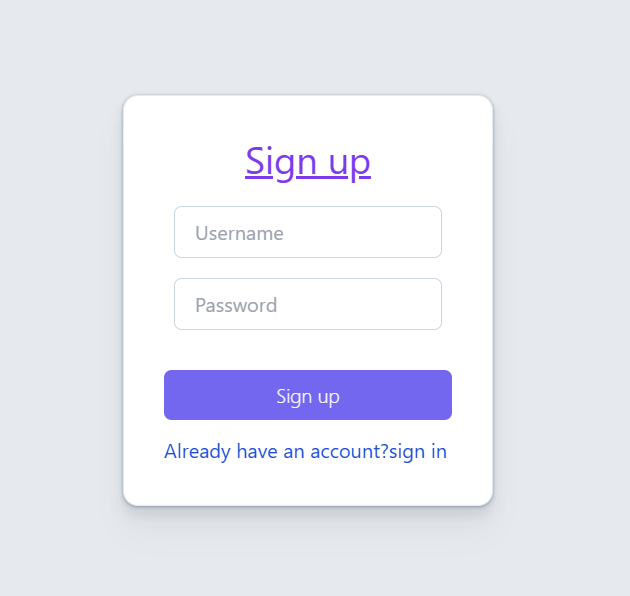

# 🧠 Second Brain – Full-Stack Personal Content Saver

A full-stack web application to store, tag, and organize important online content like videos, tweets, documents, and article links. Designed with a clean React UI and secure backend for multi-user access.

## 🔧 Tech Stack

- **Frontend**: React.js, TypeScript, Tailwind CSS, Vite
- **Backend**: Node.js, Express.js
- **Database**: MongoDB, Mongoose
- **Auth**: JWT, bcrypt
- **Validation**: Zod

## ✨ Features

- 🛡️ **User Authentication**: Sign up and sign in with email validation and hashed passwords using bcrypt.
- 🧩 **Content Creation**: Add and tag various types of content like videos, tweets, or docs.
- 📋 **Responsive Dashboard**: View all saved content in a card-based layout with modals for quick actions.
- 🔗 **Public Sharing**: Generate a unique link (`/view/:hash`) to share your saved content with others.
- 🧠 **Custom Hooks**: Uses `useContent`, `useEffect`, and `useState` for dynamic UI updates.
- 🛠️ **Schema Design**: Modular Mongoose models for Users, Content, Tags, and Share Links.

## 🔍 App Preview

### 🧠 Dashboard


### 🔐 Signin


### 📝 Signup


## 🚀 Getting Started

### 1. Clone the Repo
```bash
git clone https://github.com/your-username/second-brain.git
cd second-brain


